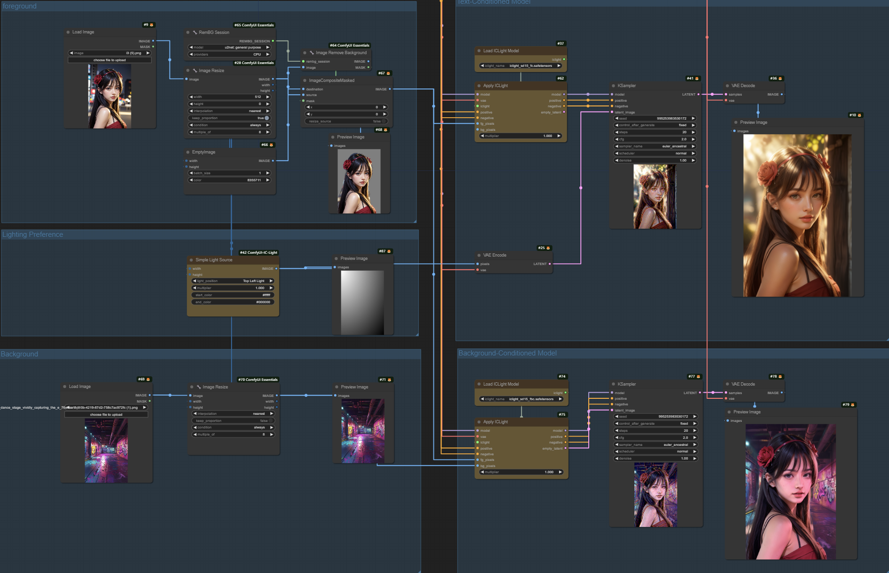
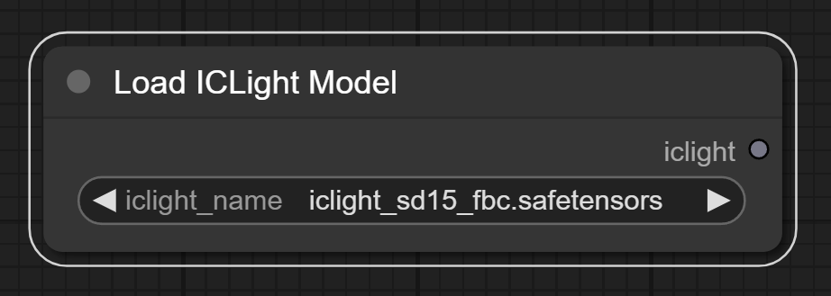
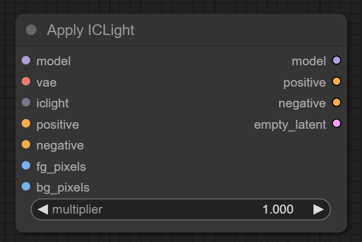
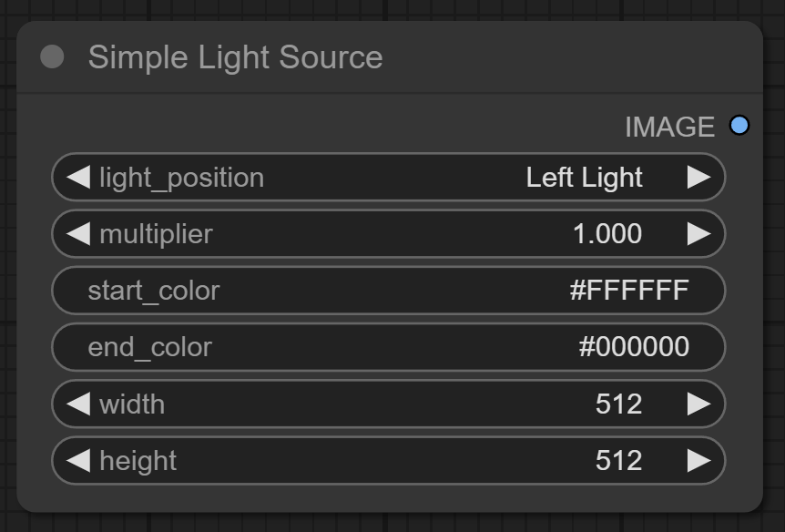
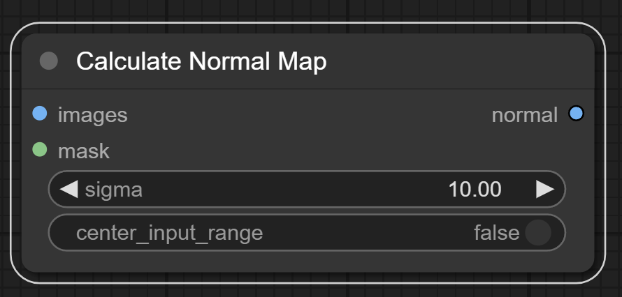
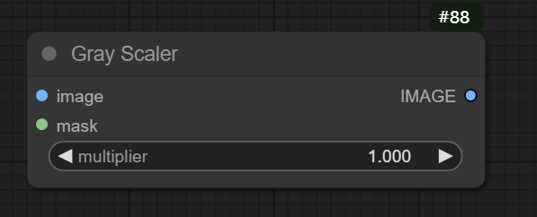

# ComfyUI Gaffer

comfyui's gaffer

## Important updates

* 2024-05-12: ComfyUI native implementation of [IC-Light](https://github.com/lllyasviel/IC-Light).

## Install

* Recommended use [ComfyUI Manager](https://github.com/ltdrdata/ComfyUI-Manager) for installation.

* Or open the cmd window in the plugin directory of ComfyUI, like ```ComfyUI\custom_nodes```，type    
  ```
  git clone https://github.com/huagetai/ComfyUI-Gaffer.git
  ```
* Or download the zip file and extracted, copy the resulting folder to ```ComfyUI\custom_ Nodes```
* Download models

  You can download models here: https://huggingface.co/lllyasviel/ic-light/tree/main
  There are 3 models:
  * iclight_sd15_fc.safetensors: Use this in FG workflows
  - iclight_sd15_fcon.safetensors: Use this in FG workflows
  - iclight_sd15_fbc.safetensors: Use this in BG workflows

  After you download these models, please put them under ComfyUI/models/iclight.

* Restart ComfyUI.

## Usage




* Text-Conditioned Model

  * refer to: [Text + foreground Conditioned](examples/workflow-gaffer-iclight-fc-text.json)

  * refer to: [Text + foreground + Lighting Preference Conditioned](examples/workflow-gaffer-iclight-fc.json)

* Background-Conditioned Model

  * refer to: [Text + foreground + background Conditioned](examples/workflow-gaffer-iclight-fbc.json)

* Calculate Normal
  
  * refer to: [Calculate Normal](examples/workflow-gaffer-iclight-fc-normal.json)

* animated

  * refer to: [Animated](examples/workflow-gaffer-iclight-fc-animated.json)

  * tips: Lighting Preference Requires [ComfyUI-KJNodes](https://github.com/kijai/ComfyUI-KJNodes)

* tips

  * Model description and input foreground and background images can be obtained [IC-Light](https://github.com/lllyasviel/IC-Light)
  * The overall brightness can be controlled through the grayscale. refer to [grayscaler-compare](examples/workflow-gaffer-grayscaler-compare.json)

## Nodes


* **Load ICLight Model Node**

  Load ICLight Model

  

  input:
  * iclight_name: The name of the ICLight model to load.
  
  output:
  * iclight: ICLight model information.


* **Apply ICLight Node**

  Apply ICLight

  

  input:
  * model: base model
  * vae: VAE
  * iclight: ICLight model information.
  * position: position prompts
  * negative: negative prompts
  * fg_pixels: foreground image.The background of the foreground image needs to be removed, and it is recommended to set it to a grayscale background.
  * bg_pixels: background image(optional).Required for Background-Conditioned Model.Consistent with the width and height of the foreground image
  * multiplier: It is recommended to keep the default value
  
  output:
  * model: model with ICLight
  * position: position prompts
  * negative: negative prompts
  * empty_latent: Empty Latent Image.The width and height are consistent with the foreground image.


* **Simple Light Source Node**
  
  Simple Light Source for Lighting Preference
  

  input:
  * light_position: Left Light, Right Light, Top Light, Bottom Light, Top Left Light, Top Right Light, Bottom Left Light, Bottom Right Light
  * multiplier: strength of Lighting Preference
  * start_color: start color of Lighting Preference
  * end_color: end color of Lighting Preference
  * width: The width of Lighting Preference
  * height: The height of Lighting Preference
  tips:Consistent with the width and height of the foreground image
  
  output:
  * image: Lighting Preference.
  
  tips:
  * different effects can be achieved by setting the start color and end color.

* **Calculate Normal Map Node**

  Calculate Normal Map

  

  input:
  * images: A sequence of input images 
  * mask: Optional, a mask image to specify the computation region.
  * sigma: The standard deviation for Gaussian blur, controlling the smoothness of the normal calculation.
  * center_input_range: The range used to center the input images.
  
  output:
  * normal: normal map
  
  **tips**:The node from [kijai-ComfyUI-IC-Light](https://github.com/kijai/ComfyUI-IC-Light) project

* **Gray Scaler Node**

  Scales the image area to gray according to the provided mask.

  
* 
  input:
  * image: transparent background image.
  * mask:  mask indicating areas to be converted to grey.
  * multiplier: A value to control the intensity of the grey conversion.
  
  output:
  * image: gray background image.
  

## Credits

* [IC-Light](https://github.com/lllyasviel/IC-Light)
* [ComfyUI](https://github.com/comfyanonymous/ComfyUI)
* [kijai-ComfyUI-IC-Light](https://github.com/kijai/ComfyUI-IC-Light)
* [huchenlei-ComfyUI-IC-Light-Native](https://github.com/huchenlei/ComfyUI-IC-Light-Native)